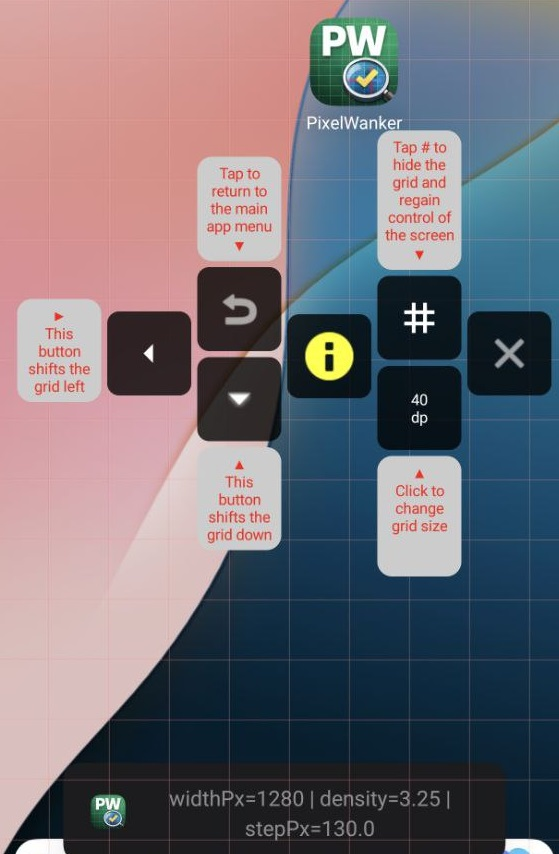

## Описание

PixelWanker накладывает измерительную сетку поверх любого приложения. Можно выбрать размер ячейки от
4 до 400 px/dp и базовый цвет линий (белый, чёрный, зелёный, красный). Дополнительно включается
второй цвет, который рисуется «двойной» линией рядом с основной — можно выбрать отсутствие второго
цвета или любой из вариантов: белый, чёрный, зелёный, красный, жёлтый, синий. Сетка состоит из
вертикальных и горизонтальных полос, их количество зависит от выбранного размера ячейки. В оверлее
есть быстрые кнопки скрытия сетки, смещения по шагу и выхода. Также доступен список установленных
приложений — откройте карточку и запустите приложение вместе с сеткой.

## Технологический стек
- **Использовал для написания кода chatgpt, Codex.
- **Язык и сборка:** Kotlin 2.2, Java 17, Gradle (Kotlin DSL).
- **UI:** Jetpack Compose + Material/Material3, собственная тема и компоненты.
- **Локализация:** 7 языков (русский, английский, испанский, хинди, французский, португальский, японский).
- **Навигация:** Navigation Compose.
- **Асинхронность и состояние:** Kotlin Coroutines, StateFlow, ViewModel.
- **Работа с разрешениями:** Accompanist Permissions, Peko.
- **Изображения:** Coil.
- **Эффекты UI:** Haze (blur).
- **Системный слой:** AndroidX, overlay через `WindowManager` + `TYPE_APPLICATION_OVERLAY`.
- **Хранение настроек:** SharedPreferences (GridSettingsStore).

## Архитектура

- **Single-Activity:** входная точка `MainActivity`, весь интерфейс в Compose.
- **MVVM:** экраны используют `ViewModel`, состояние передаётся через `StateFlow`, события обрабатываются в UI-слое.
- **Repository слой:** `InstalledAppsRepository` изолирует работу с `PackageManager` и отдаёт модели домена.
- **Навигация по экранам:** `NavGraph` на базе Navigation Compose.
- **Сервис оверлея:** `PixelWankerOverlayService` создаёт и управляет сеткой через `WindowManager`, а также
  кнопками управления (сдвиг, скрытие, выход).
- **Хранилище настроек сетки:** `GridSettingsStore` сохраняет параметры сетки и восстанавливает их при запуске.

## Ссылка в GooglePlay
https://play.google.com/store/apps/details?id=com.pavlovalexey.pavlovAlexeySandbox

## Jenkins (быстрый старт)

Да, проект можно быстро подключить к Jenkins: в репозиторий добавлен `Jenkinsfile` с базовыми Android/Gradle проверками.

Минимальные шаги:
1. Установить Jenkins (LTS) и JDK 17 на агенте.
2. Создать Pipeline job -> *Pipeline script from SCM* -> указать этот репозиторий.
3. Запустить сборку: Jenkins выполнит `clean`, `testDebugUnitTest` и `lintDebug`.

Базовый пайплайн публикует JUnit XML и отчёты из `build/reports` как артефакты.

### FAQ по JUnit и сборкам

- **Jenkins проверяет то же самое, что и локальный JUnit?**  
  Да. В нашем `Jenkinsfile` выполняется Gradle-задача `testDebugUnitTest`, это те же unit-тесты JUnit (папка `app/src/test`), которые разработчик может запускать локально.

- **Запускаются ли JUnit автоматически при `assembleDebug` / `assembleRelease`?**  
  По умолчанию — нет. Задачи сборки APK/AAB (`assemble*`, `bundle*`) не обязаны запускать unit-тесты автоматически. Для обязательной проверки нужно запускать `testDebugUnitTest` отдельно или использовать `check`/CI pipeline.

- **Что будет, если JUnit-тест упадёт?**  
  Gradle завершит задачу тестов с ошибкой (ненулевой exit code), и stage в Jenkins станет `FAILED`. При этом отчёты будут доступны в `build/reports/tests/...` и `build/test-results/...`.
